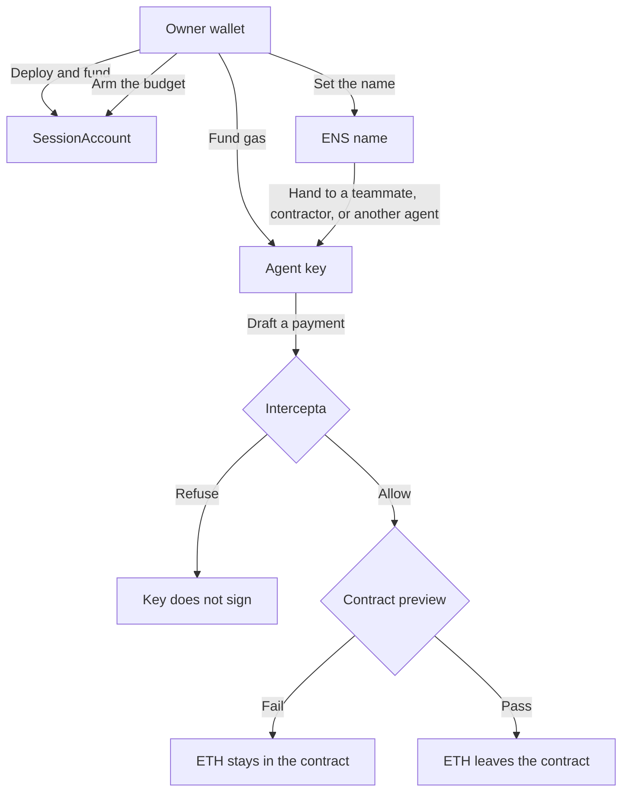

# Chainkeys

The owner sets a budget. The agent gets its own key and a public name. Intercepta checks who would be paid before that key signs. The contract sends the ETH, and only inside the budget.

## Two keys

| Key | Who | What it does |
| --- | --- | --- |
| **Owner** | You, in your browser wallet | Deploy the contract, fund it, arm the policy, fund the agent's gas |
| **Agent** | A separate key created in the app | Signs payments. Cannot raise the cap, extend the time, or rename itself |

The spendable ETH sits on the contract. The agent key only holds a little ETH for gas.

## How a payment moves



## Run it

```bash
npm install --prefix web
npm start
```

Open http://127.0.0.1:5175/

Copy `.env.example` to `.env` if you want live Intercepta screening and Etherscan verification. Do not commit `.env`.

## Try it

1. **Owner.** Connect your wallet, deploy the contract on Sepolia, and load ETH into it.
2. **Agent.** Create a wallet. The private key stays in this browser. Fund gas from the owner wallet.
3. **Policy.** Arm the budget: 0.05 ETH, 15 minutes, Uniswap, 1inch, one genuine wallet, and USDC.
4. **Test.**
   - Drain to `0x…dEaD` is refused. The agent does not sign.
   - Uniswap, 1inch, and the genuine wallet pass. The agent key sends the transaction. The result links to Sepolia Etherscan.

## ENS

The agent is named under a name you already own, such as `agent.ravish1729.eth`.

- Arming writes that name onto the Sepolia contract (`agentEns`). Only the owner can set it.
- Anyone can look the name up on Ethereum mainnet with no wallet. The address record is the agent key. A text record can point at the Sepolia contract that holds the funds.
- The homepage and **Look up a name** read those mainnet records.

## Intercepta

Before the agent signs, the app asks Intercepta about the payment. The check uses Ethereum mainnet data, not Sepolia.

- **Who would be paid.** A wallet is scored with an address scan. A contract such as Uniswap or 1inch is scored with a contract scan.
- **Which token**, on a swap. Token risk is requested with `chainId=1` (Ethereum mainnet).

A score of 50 or more, or a token marked `block`, refuses the payment. The key never signs, so no transaction is sent. USDC and a known-good wallet pass. The demo scam token is refused by the app's own check when Intercepta has no record for that address. Sepolia only runs the payment after the screen allows it.

## Future work

- **Pay a name.** The agent drafts `uniswap.eth` or `vitalik.eth`. The app resolves it on mainnet and refuses when that address is not the one in the draft, before Intercepta and before the key signs.
- **Clear the name on revoke.** Revoke already clears `agentEns` on the Sepolia contract. The mainnet address record and the `agent-account` text record should clear in the same step, so the name stops advertising a key that can no longer spend.
- **Hand the key over.** The session key stays in the owner's browser. Giving the session to someone else should pass them that key, or a signer scoped to this budget, without pasting it into a chat.
- **Real swaps.** Uniswap v4 and 1inch are allowlisted addresses. On Sepolia those routers have no code, so a passing swap moves ETH to that address. A real fill is a later step.
